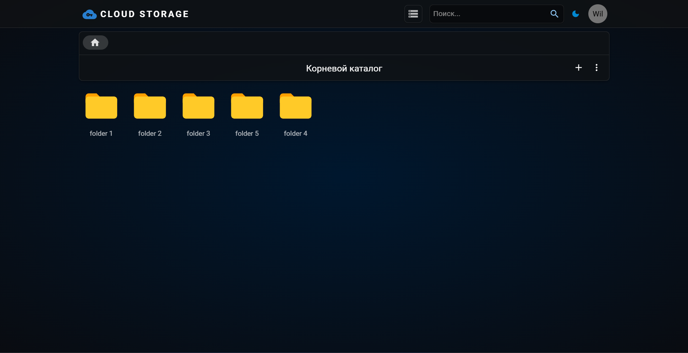

<h1 align="center">
  Cloud File Storage
   
</h1>

<h4 align="center">Multi-user file cloud. Service users can use it to upload and store files.</h4>

## Deploy

- Endpoint: http://52.91.61.98:8888

## Key Features

- Upload, rename, delete and download files & folders
- Deep recursive files search

## Technology Stack

## Acknowledgements

Minio does not have folders. Everything in minio is an "object". Folders are created based on the `/` - forward slashes in the filename

- Folders in the app may work unpredictably
- There is no possible to download empty folder to the app
- Maximum size of one file to upload - 200 MB
- Maximum size of multiple files to upload is also - 200 MB
- Currently, all files are uploaded to the root directory (this behavior will be fixed in the future)
- It is not possible to select multiple files or folders to download at once (this behavior will be fixed in the future)
- It is possible to change extension of the downloaded file in the renaming option
- Search will list all files and folders that contains search query. Broad search queries like "a" can produce very large list of results
- Frontend is not adapted to the mobile platforms

## Instructions to run the application using docker

- Docker should be installed
- Clone backend project `git clone https://github.com/WillSalas2002/cloud-storage.git`
- Clone frontend project `git clone https://github.com/WillSalas2002/cloud-storage-front.git`
- On backend project root folder run command: `docker compose build -t cloud-storage .`
- On frontend project root folder run command: `docker compose build -t front-end .`
- In the browser try to access endpoint `http://localhost:8888`
- 
- In case you want to run with debug mode in intellij, just run the application with `local` profile and it will work